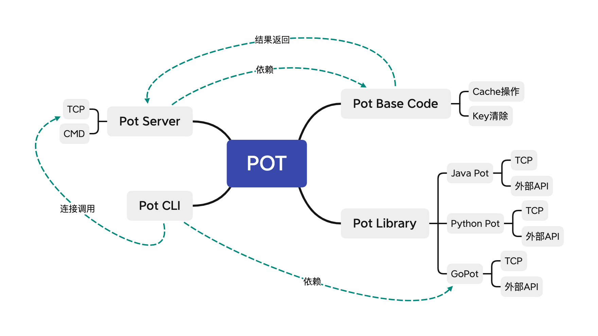
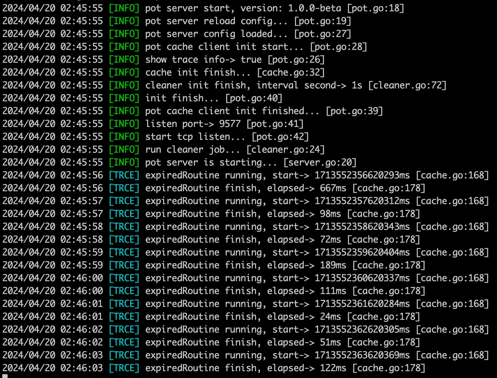
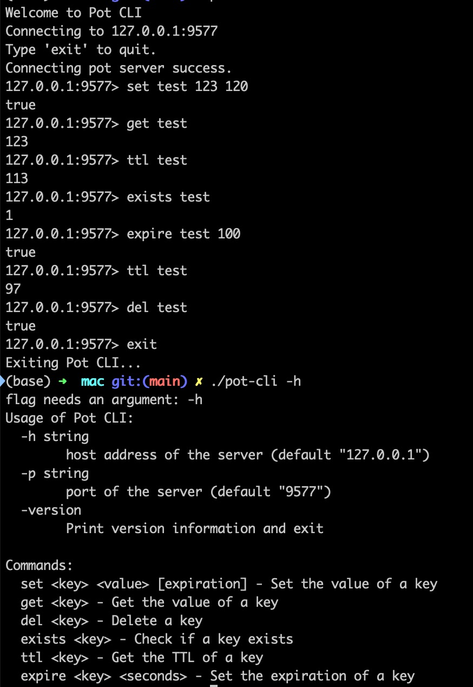

## Pot
- 基于`Golang`实现的`k-v`缓存数据库，目前规划为轻量、便捷、小容量，用于在简单业务中进行一些临时数据、轻量逻辑的实现。
- 接下来会逐步进行完善，实现完善的k-v存储DB

## 功能规划
- ✅ 基础架构
- ✅ 基础存储功能
- ✅ Key支持有效期设置
- ✅ 过期Key清除功能
- ✅ 返回数据类型处理
- ✅ 远程调用支持
- ✅ `Go Library`
- [ ] `Java Library`
- [ ] `Python Library`
- [ ] 支持备份到磁盘
- [ ] 支持重启数据恢复
- [ ] 支持基础数据、有序集合、无序集合
- [ ] 支持多机分布式部署

## 架构简述
- `Pot`全系工具都是采用的`Go`语言开发，全部使用的是Go原生的库及内容，没有任何第三方库的调用。

- `Pot`主要由`Pot Server`、`Pot Client`、`Pot Base`组成

- `Pot Base`：实现数据缓存相关的基本操作库

- `Pot Server`：基于TCP协议实现的可远程部署调用的应用

- `Pot Client`：主要分为两类，一类是`Pot CLI`、一类是`Pot Library`，其中`Pot CLI` 为终端调用工具，而`Pot Library`则包含各种编程语言远程连接调用`Pot Server`的工具库

- 可以通过下面的架构图做个简要的了解，详细的可以通过源代码进行分析查看

## 远程调用
远程调用实现方案，即单独部署一台`Pot`存储服务，业务服务通过TCP连接后进行远程调用，该方案适用于业务服务分布式部署、多机部署、缓存同步的情况。 

***具体使用方法可通过下面的链接进行深入了解***

- 通信协议：`TCP`
- 端口：默认`9577`
- [Pot Server通信协议](https://github.com/swxctx/pot/blob/main/server/protocol.md)
- [支持直接运行源码启动](https://github.com/swxctx/pot/tree/main/server#%E7%9B%B4%E6%8E%A5%E8%BF%90%E8%A1%8C%E6%BA%90%E7%A0%81%E5%90%AF%E5%8A%A8)
- [支持源码编译启动](https://github.com/swxctx/pot/tree/main/server#%E6%BA%90%E7%A0%81%E7%BC%96%E8%AF%91%E5%AE%89%E8%A3%85)
- [支持直接下载安装包启动](https://github.com/swxctx/pot/tree/main/server#%E7%9B%B4%E6%8E%A5%E4%B8%8B%E8%BD%BD%E5%AE%89%E8%A3%85%E5%8C%85%E5%90%AF%E5%8A%A8)
- [支持安装进行本地CLI调用](https://github.com/swxctx/pot/tree/main/cli)
- [提供多种语言调用客户端代码](https://github.com/swxctx/pot/tree/main/library)

***Pot Server运行效果***

***Pot CLI运行效果***

## 单机调用
***Golang库*** 
单机使用即针对于服务器单台机器部署的情况，这种情况下，不需要多台机器的业务服务进行缓存同步，那么直接引用当前的实现库也是可以的。也可以使用 [gset](https://github.com/usthooz/gset) 实现，在远程调用时推荐使用Pot 

[***Go语言单机缓存服务可以参照此处进行工具库使用***](https://github.com/swxctx/pot/tree/main/example)