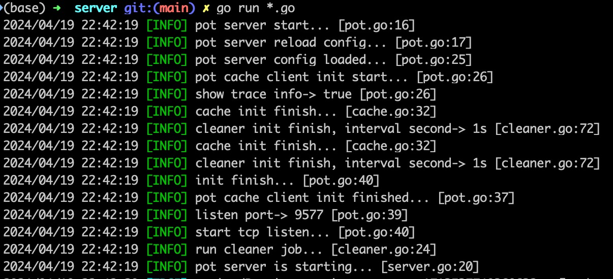
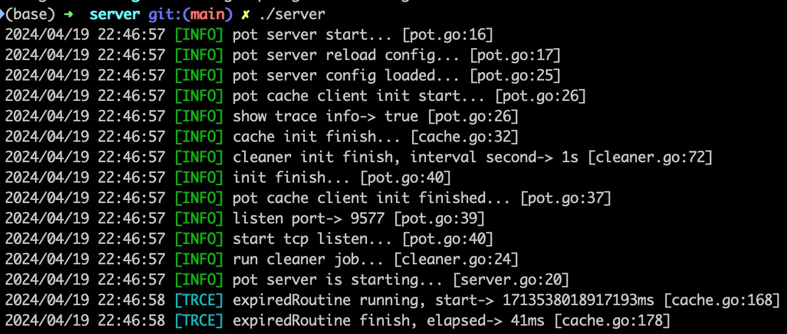

## Pot
该项目为完整的可部署远程调用的 k-v 缓存工具，目前支持单机部署，多业务远程调用，架构与Redis、Memcache类似，会逐渐进行功能完善，包括缓存落地存储、数据恢复、热加载等。

目前实现的命令如下

- set
- get
- ttl
- expire
- del
- exists

## 安装
`Pot`提供源码，所以比较灵活，可以直接编译启动即可，同时也提供了打包好的安装包，直接下载启动即可。

***支持的安装方式如下***

- 直接运行代码(不推荐)
- 源码编译安装
- 直接下载安装包启动

### 直接运行源码启动

- 下载代码

```
git clone https://github.com/swxctx/pot.git
```

- 进入`server`目录

```
cd pot/server
```

- 运行`Pot`服务

```
go run *.go
```

- 运行效果

运行后出现如下效果，即表示`Pot`服务已经启动了，监听端口为`9577`



### 源码编译安装

- 下载代码

```
git clone https://github.com/swxctx/pot.git
```

- 进入`server`目录

```
cd pot/server
```

- 编译

```
go build
```

- 运行服务

```
./server
```

- 运行效果

运行后出现如下效果，即表示`Pot`服务已经启动了，监听端口为`9577`



### 直接下载安装包启动